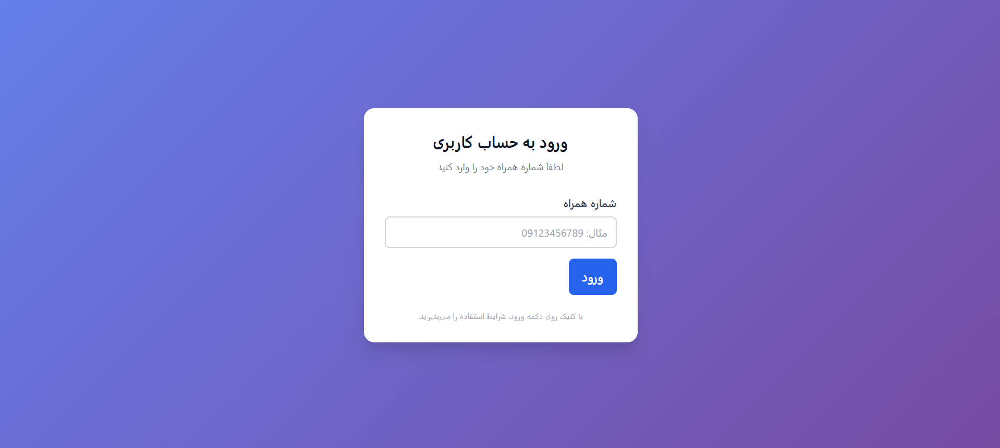
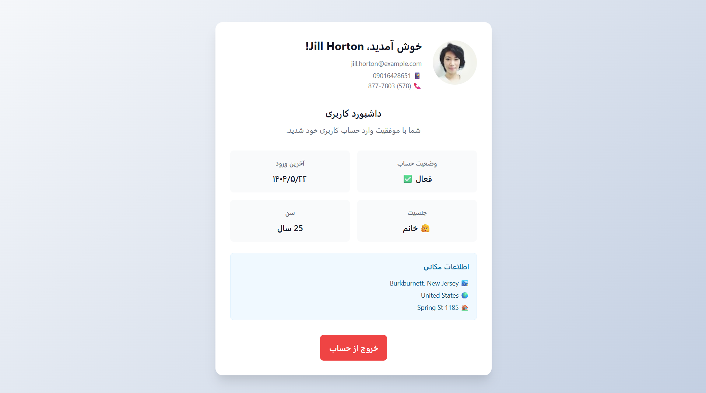

# 🔐 پروژه احراز هویت Next.js

<div align="center">
**پروژه احراز هویت کامل با Next.js، TypeScript و طراحی مدرن فارسی**

[](https://wespaarweb.github.io/my-auth/)
[](https://github.com/wespaarweb/my-auth-app/releases/latest)
[](LICENSE)

</div>

## ✨ ویژگی‌ها

- 🚀 **Next.js 15** با App Router
- 💎 **TypeScript** برای Type Safety
- 🎨 **SCSS Modules** برای استایل‌دهی
- 📱 **Responsive Design** - روی همه دستگاه‌ها کار می‌کنه
- 🔒 **Form Validation** با Zod و React Hook Form
- 💾 **Local Storage** برای نگهداری وضعیت
- 🇮🇷 **پشتیبانی RTL** فارسی

## 🎮 تست سریع

👉 **[کلیک کنید و الان تست کنید!](https://wespaarweb.github.io/my-auth/)**

**شماره تست:** `09123456789`

## 📥 دانلود برای استفاده محلی

### برای کاربران عادی

1. از [Releases](https://github.com/WespaarWeb/my-auth/releases/latest) آخرین نسخه رو دانلود کنید
2. فایل ZIP رو Extract کنید
3. روی `Start-Windows.bat` دابل کلیک کنید
4. یا `static-build/index.html` رو در مرورگر باز کنید

### برای توسعه‌دهندگان

```bash
git clone https://github.com/WespaarWeb/my-auth.git
cd my-auth
npm install
npm run dev
```

## 🛠️ ساخت و توسعه

```bash
# نصب وابستگی‌ها
npm install

# اجرای حالت توسعه
npm run dev

# ساخت نسخه نهایی
npm run build

# صادر کردن فایل‌های استاتیک
npm run export
```

## 📱 تصاویر

<div align="center">

### صفحه ورود



### داشبورد کاربری



</div>
